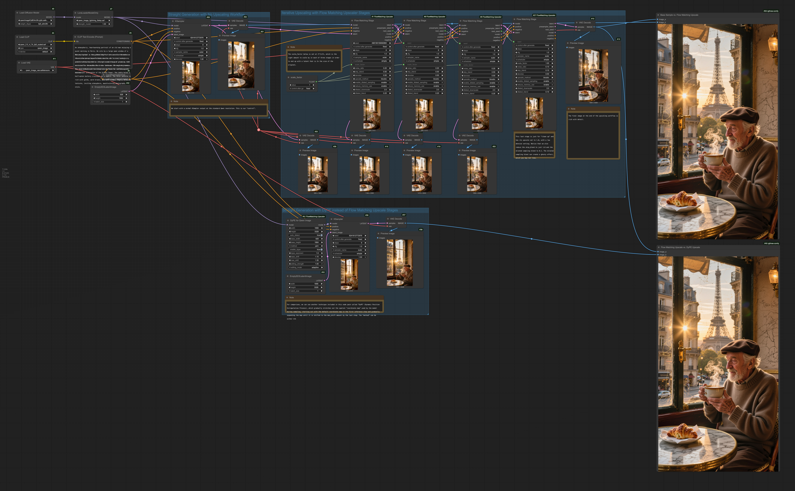

<p align="left">
  
</p>

# ComfyUI Flow Matching Upscaler

## Overview

This repository ships a progressive upscaling node designed for flow-matching
models such as Qwen Image, alongside a powerful model patcher (DyPE) to enable
high-resolution generation.

1.  **Flow Matching Progressive Upscaler:** Implements the approach outlined in
    `docs/Approach.pdf`. It incrementally doubles resolution, re-noises the
    latent in a flow-consistent manner, denoises with the selected sampler, and
    blends skip residuals to preserve composition.
2.  **DyPE for Qwen Image:** A model patch node that extends Qwen Image’s
    spatial rotary embeddings. It allows the diffusion model to stay coherent
    far beyond its native training resolution by applying Dynamic Position
    Extrapolation (DyPE).
3.  **Mesh Drag (Latent / Image):** Spatial perturbation nodes that drag random
    mesh vertices to create cloth-like warps while keeping the overall content
    recognizable.

## Installation

1. Clone this repository inside the `custom_nodes/` directory of your ComfyUI
   installation.
2. Launch ComfyUI; the nodes will be registered under **latent/upscaling**, **latent/perturb**, **latent/debug**, and **model_patches/unet** categories.

## Example Workflow

[](examples/Method-Comparison.json)

---

## Part 1: Flow Matching Progressive Upscaler

### How Flow Matching Upscaling Works

<p align="left">
  
</p>

In traditional diffusion models (like SD1.5 or SDXL), generating an image is
often described as "removing noise" layer by layer. However, **Flow Matching**
models (like Qwen) work a bit differently: think of them as calculating a
direct, straight-line path (a "flow") from a chaotic state (noise) to an
ordered state (your image).

When you use Flow Matching Upscaler nodes, you aren't just denoising; you are
traveling along a specific trajectory.
1.  **Stage 1:** Generates your base image by following this path at a lower resolution.
2.  **Stage 2 (The Upscale):** Instead of just stretching the image and adding random noise (like standard "img2img"), the node physically resizes your latents and then mathematically "rewinds" the clock.

As shown in the center of the diagram, we step back along the timeline—for
example, rewinding from the finished state ($t=0.0$) back to a mid-point
($t=0.6$). This places the model back onto the flow trajectory but at a much
higher resolution. Because the model is resuming an existing journey rather
than starting a new one, it doesn't hallucinate new objects or change your
composition; it simply "flows" forward again, filling in the missing
high-frequency details.

### Key Concepts

#### The Role of the `Noise` Parameter
In Flow Matching, noise isn't just "randomness"—it is mathematical validity.
*   **Validating Time:** A specific time on the flow trajectory (e.g., $t=0.6$) mathematically expects a specific mix of signal and noise. If you provide a clean upscaled image at $t=0.6$, the model gets confused. The noise parameter adds the necessary static back so the latent matches the statistical expectations of that timestep.
*   **Texture Fuel:** The noise provides a substrate for the model to "carve" details into. Without it, upscales can look waxy or plastic.
*   **Preventing Burn-in:** Noise dithers upscaling artifacts (like blocky edges), allowing the model to hallucinate cleaner, sharper edges in their place.

#### Dilated Sampling
Dilated sampling adds a coarse refinement lap immediately after the main sampler completes each stage.
1.  **Downscale:** Shrinks the freshly denoised latent (acting as a low-pass filter).
2.  **Sample:** Runs a short sampler pass in that reduced space.
3.  **Blend:** Upscales and mixes it back into the main result.

*Use this to suppress high-frequency hallucinations (like extra pores or glittering artifacts).*

##### Dilated Blend Strategy

Dilated refinement now always uses a frequency-domain blend when recombining the low-pass latent with the original samples. The FFT-based mix pulls low frequencies from the dilated pass and preserves high-frequency detail from the base latent, which consistently avoids the grid artifacts that the alternative modes were designed to mitigate. With this default in place, no explicit blend selector is required.

### Usage Tips

*   **Upscaling is Optional:** You don't have to upscale! Set `total_scale` to 1.0 to use this node for "Refinement." It gives the model a second chance to generate details on an existing latent without changing the resolution.
*   **Memory Use:** The upscaler samples the full latent. If VRAM is exhausted, the node automatically switches to a streaming fallback (LOW_VRAM mode), throttling the attention kernels. It will be slower, but it will not crash.
*   **Mask-aware Upscaling:** When the input latent ships with a `noise_mask`, the nodes upscale the mask alongside the latent so inpaint workflows keep their boundaries aligned at every stage.

### Node Parameters: Progressive Upscaler

**Required inputs**

| Field | Type | Default | Purpose |
|-------|------|---------|---------|
| `model` | MODEL | – | Flow-matching diffusion model. |
| `positive` | CONDITIONING | – | Positive conditioning. |
| `negative` | CONDITIONING | – | Negative conditioning. |
| `latent` | LATENT | – | Base latent to upscale. |
| `seed` | INT | `0` | Base seed. |
| `steps_per_stage` | INT | `16` | Sampler steps per stage. |
| `cfg` | FLOAT | `4.5` | Guidance strength. |
| `sampler_name` | choice | – | Sampler backend. |
| `scheduler` | choice | – | Scheduler curve. |
| `total_scale` | FLOAT | `4.0` | Final size = base size × `total_scale`. |
| `stages` | INT | `2` | Number of progressive stages to reach total scale. |
| `renoise_start` | FLOAT | `0.35` | Noise ratio at the first stage. |
| `renoise_end` | FLOAT | `0.15` | Noise ratio at the final stage. |
| `skip_blend_start` | FLOAT | `0.8` | Mix weight of the upscaled latent before denoising (Stage 1). |
| `skip_blend_end` | FLOAT | `0.05` | Final-stage skip weight. |
| `upscale_method` | choice | `bicubic` | Resampling algorithm. |

**Optional controls**

| Field | Type | Default | Purpose |
|-------|------|---------|---------|
| `noise_schedule_override` | STRING | `""` | Comma-separated overrides for renoise ratios. |
| `skip_schedule_override` | STRING | `""` | Comma-separated overrides for skip weights. |
| `denoise` | FLOAT | `1.0` | Global denoise strength. |
| `enable_dilated_sampling` | enum | `"enable"` | Adds the dilated refinement pass. |
| `dilated_downscale` | FLOAT | `2.0` | Downscale factor for dilation. |
| `dilated_blend` | FLOAT | `0.25` | Blend weight of the dilated result. |
| `cleanup_stage` | enum | `"disable"` | Adds an extra non-scaling polish stage. |

### Modular Nodes

For complex workflows, you can use the individual components of the upscaler.

#### 1. FlowMatchingStage
Chain these nodes manually for caching benefits.

**Key Inputs:**
*   `scale_factor`: How much to resize in this specific step.
*   `noise_ratio`: Amount of flow-noise to inject.
*   `skip_blend`: Blend factor between pre-sampler latent and denoised result.
*   `next_seed`: Connect this output to the `seed` of the next stage for deterministic chains.
*   Dilated refinement blends results in the frequency domain automatically—no manual method selection is required.

#### 2. LatentChannelStatsPreview
A lightweight debug node that visualizes latent channel statistics (Means = Blue, Std Dev = Orange). Useful for spotting channels that dominate energy budgets.

---

## Part 2: DyPE for Qwen Image

### How DyPE Works

<p align="left">
  
</p>

Models like Qwen are trained on a specific "map" size (e.g., 1024x1024). When you generate 4K images, you force the model off the edge of its map, causing it to hallucinate repeating patterns (cloning artifacts).

**DyPE (Dynamic Position Extrapolation)** treats generation as a journey.
1.  **Early Steps:** It keeps coordinates close to the native training size to secure solid composition.
2.  **Later Steps:** It dynamically expands the grid (using an exponential ramp) as the sampler progresses.

This allows the model to "see" the massive 4K canvas clearly exactly when it needs to paint high-frequency details, preventing the "washed out" look of standard stretching.

### Understanding the Methods

The `method` parameter determines the math used to handle coordinates outside the training resolution.

| Method | Fidelity | Sharpness | Recommended Use Case |
| :--- | :--- | :--- | :--- |
| **YaRN** | High | High | **Default for Images.** Best for 2K/4K generation. Preserves texture by handling frequency bands separately. |
| **NTK** | Medium | Medium | **Smoother.** Uniformly scales rotation speed. Use this if YaRN looks "jagged" or over-sharpened. |
| **Base** | Native | N/A | **Vanilla.** Turns off spatial extrapolation. Use for testing or native-resolution generation. |

### Node Parameters: DyPE for Qwen Image

**Required inputs**

| Field | Type | Default | Purpose |
|-------|------|---------|---------|
| `model` | MODEL | – | Qwen Image diffusion model. |
| `width` / `height` | INT | `1024` | Target render resolution (must match your latent). |
| `auto_detect` | BOOLEAN | `True` | Automatically infer patch size/base resolution from model. |
| `method` | enum | `yarn` | Extrapolation strategy (see table above). |
| `enable_dype` | BOOLEAN | `True` | Toggle the dynamic scaling over time. |
| `dype_exponent` | FLOAT | `2.0` | How aggressively DyPE ramps. Higher = stays closer to base res longer. |
| `base_shift` | FLOAT | `1.15` | Baseline noise schedule shift. |
| `max_shift` | FLOAT | `1.35` | Max noise schedule shift at target resolution. |
| `editing_strength` | FLOAT | `1.0` | Lower this to preserve original structure during Inpainting/Img2Img. |
| `editing_mode` | enum | `adaptive` | Tapering strategy for edits. |

**Outputs**
- `model`: The patched model ready for the KSampler.

---

## Part 3: Mesh Drag

`Latent Mesh Drag` applies a cloth-like deformation directly to a `LATENT` by
randomly dragging a subset of vertices on a coarse mesh and smoothly
interpolating the displacement across the latent.

Drag distances are specified in **latent pixels** (multiply by ~8 for image-space pixels with SD-style VAEs).

### Node Parameters: Latent Mesh Drag

| Field | Type | Default | Purpose |
|-------|------|---------|---------|
| `latent` | LATENT | – | Latent to warp. |
| `seed` | INT | `0` | Controls vertex selection and drag vectors. |
| `points` | INT | `12` | Number of mesh vertices to drag. |
| `drag_min` | FLOAT | `0.0` | Minimum drag distance (latent pixels). |
| `drag_max` | FLOAT | `4.0` | Maximum drag distance (latent pixels). |
| `displacement_interpolation` | enum | `bicubic` | Interpolation used to expand the mesh drags into a displacement field (`bspline` is smoother). |
| `spline_passes` | INT | `2` | B-spline smoothing passes (only used when `displacement_interpolation = bspline`). |
| `sampling_interpolation` | enum | `bilinear` | Interpolation used while sampling the source latent during the warp. |

---

`Image Mesh Drag` applies the same deformation in image space and accepts ComfyUI `IMAGE` tensors.

Drag distances are specified in **image pixels**.

### Node Parameters: Image Mesh Drag

| Field | Type | Default | Purpose |
|-------|------|---------|---------|
| `image` | IMAGE | – | Image to warp. |
| `seed` | INT | `0` | Controls vertex selection and drag vectors. |
| `points` | INT | `12` | Number of mesh vertices to drag. |
| `drag_min` | FLOAT | `0.0` | Minimum drag distance (image pixels). |
| `drag_max` | FLOAT | `32.0` | Maximum drag distance (image pixels). |
| `displacement_interpolation` | enum | `bicubic` | Interpolation used to expand the mesh drags into a displacement field (`bspline` is smoother). |
| `spline_passes` | INT | `2` | B-spline smoothing passes (only used when `displacement_interpolation = bspline`). |
| `sampling_interpolation` | enum | `bilinear` | Interpolation used while sampling the source image during the warp. |

---

## Development

### Running tests

Use `pytest`; the suite installs lightweight `comfy` and `nodes` stubs so it can
run outside of a live ComfyUI process:

```bash
pytest
```

### Logging

The node uses Python's logging subsystem. Enabling DEBUG level emits per-channel mean and standard deviation diagnostics, useful for probing latent space behavior.
